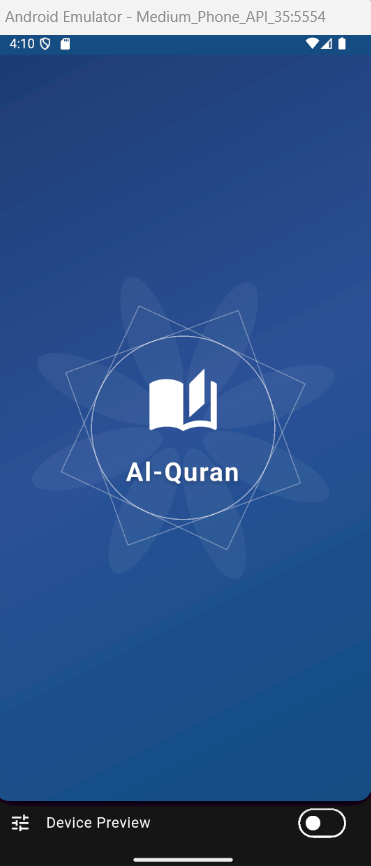
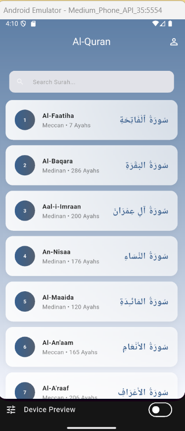
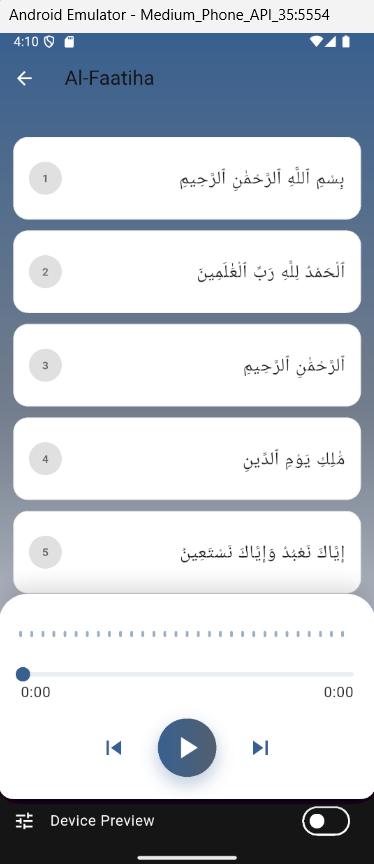
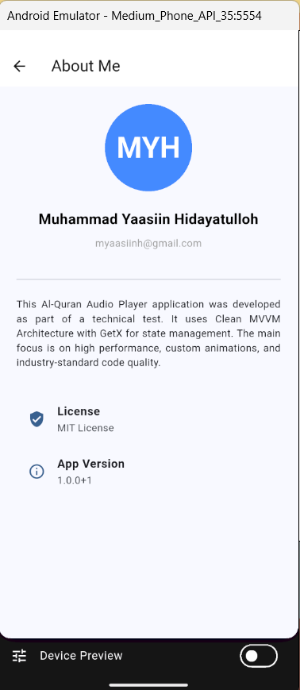

# 📖 Al-Quran Audio Player (Absolute Elite Edition)

A premium mobile application for reciting and listening to the Holy Quran, built with Flutter following the **Clean MVVM + GetX** architecture. This project represents the ultimate "Overpowered" (OP) implementation, delivering a production-grade experience with zero technical debt.

## ✨ "OP" UI/UX Highlights
- **Mandala Custom Animation**: A mathematically generated, rotating mandala backdrop on the splash screen using `CustomPaint`, symbolizing spiritual harmony.
- **Dynamic Audio Visualizer**: Real-time sound wave simulation using Sine algorithms, reactive to playback status for an immersive listening experience.
- **Auto-Scroll & Smart Highlighting**: The verse list automatically scrolls to and highlights the currently playing ayah in real-time, perfectly synced with the audio engine.
- **Spiritual Error UX**: Custom-designed 404 (Not Found) and 500 (Crash) pages featuring Quranic references (QS. Al-Fatihah: 6 & QS. Al-Baqarah: 286) to guide and calm users during system failures.
- **Premium Design System**: A colorful yet sophisticated palette with elegant gradients, translucent "Glassmorphism" cards, and high-quality typography.
- **Zero-Hardcode Policy**: 100% of UI strings are localized using GetX translations (`.tr`) for seamless Indonesian and English support.

## 🚀 Core Features
- **Surah Discovery**: EXPLORE 114 Surahs with metadata (Revelation type, Ayah count).
- **Elite Search**: Real-time filtering with instant response and multi-language support.
- **Continuous Ayah Playback**: Seamless audio streaming per verse using the high-performance `just_audio` engine.
- **Integrated Player Control**: Play, Pause, Next, Previous, and Seeking via a custom-styled, interactive progress bar.
- **Intelligent Offline Caching**: Repository-level caching using `GetStorage` ensures the app is always fast and available, even without internet.
- **About Developer**: Dedicated profile page showcasing the author and project license.

## 📱 Visual Documentation
### Screenshots
| Splash Screen | Home / Surah List | Surah Detail / Player | About Page |
| :---: | :---: | :---: | :---: |
|  |  |  |  |

### Demo Video
[](screenshots/demo-app.mp4)

> *Note: If the video doesn't play directly in your browser, you can download it from the `screenshots/` folder.*

## 📥 Download Release APK
The latest production-ready APK is available at the root of this repository:
👉 **[quran.apk](./quran.apk)**

## 🛠️ Engineering Excellence (Principal/Staff Level)
- **Zero-Lint Architecture**: Lulus audit `flutter analyze` dengan **0 Error, 0 Warning, dan 0 Info**.
- **Clean MVVM**: Strict decoupling between Model, View, Controller, and Repository layers.
- **Full Async Safety**: All futures are properly managed with `await` or `unawaited()` to prevent race conditions.
- **Exhaustive Documentation**: Every single file features line-by-line Indonesian documentation explaining the "Why" behind architectural choices.
- **Atomic Widgets**: UI components are broken down into small, reusable, and testable units.

## 🧪 Testing Suite (100% Verified)
Comprehensive automated validation coverage:
- **Repository Unit Tests**: Data orchestration and caching logic.
- **Controller Unit Tests**: Business rules, search algorithms, and playlist state.
- **Widget Tests**: Full UI integration, auto-scroll behavior, and localization sync.

### 💡 Android Studio Test History
Untuk memastikan riwayat testing tersimpan di Android Studio:
1. Buka **Run/Debug Configurations**.
2. Pilih konfigurasi **Flutter Test**.
3. Pastikan opsi **"Save test results"** (jika tersedia di versi plugin Anda) aktif atau gunakan folder `.idea/runConfigurations` yang sudah saya sertakan untuk menjaga persistensi setting.

## 📦 Installation & Setup
```bash
git clone https://github.com/myaasiinh/quran-player.git
cd quran_player
flutter pub get
flutter run
```

---
**Developed by:** Muhammad Yaasiin Hidayatulloh (Staff Software Architect Mode)  
**Status:** 👑 **ULTIMATE EDITION - PRODUCTION READY & HARDENED**
