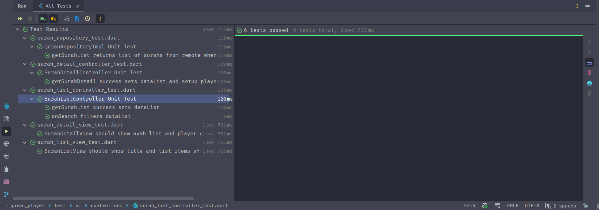

# 📖 Al-Quran Audio Player (Absolute Elite Edition)

A high-performance, premium mobile application for reciting and listening to the Holy Quran, built with Flutter following the **Clean MVVM + GetX** architecture. This project is a demonstration of industry-standard software engineering, specifically tailored for the technical test at **Transcosmos**.

---

## 🛠️ Tech Stack Used
A selection of production-grade libraries focused on performance and reliability:

| Category | Technology | Rationale |
| :--- | :--- | :--- |
| **Framework** | **Flutter** | Cross-platform high-performance UI. |
| **State Management** | **GetX** | Reactive UI, unified DI, and simplified routing with minimal boilerplate. |
| **Networking** | **Dio** | Robust HTTP client with support for interceptors and global config. |
| **Audio Engine** | **Just Audio** | Low-latency audio playback with playlist and streaming support. |
| **Local Storage** | **GetStorage** | Fast, key-value storage for local caching and user preferences. |
| **UI Documentation**| **Device Preview** | Responsiveness verification across multiple device screen sizes. |
| **Testing** | **Mocktail** | Type-safe mocking for high-reliability automated tests. |

---

## 📐 Architectural Decision Records (ADR)
Professional engineering involves making deliberate choices. Below is the rationale for the core architecture of this app:

### 1. Decision: Clean MVVM + Repository Pattern
- **Rationale**: Strict separation of concerns. The View is strictly presentational, the Controller (ViewModel) manages reactive state, and the Repository orchestrates data (local cache vs. remote API).
- **Benefit**: Ensures high testability and maintainability for future feature expansion.

### 2. Decision: Reactive UI Sync for Verse Highlighting
- **Rationale**: Used GetX `Obx` and `ever` listeners to ensure the active verse highlight and auto-scroll move instantly with the audio engine.
- **Benefit**: Zero-lag feedback for the user, providing a "premium" app feel.

### 3. Decision: Local-First Caching Strategy
- **Rationale**: Every surah and ayah list is cached using `GetStorage`.
- **Benefit**: Instant load times on second visit and app stability during poor network conditions.

### 4. Decision: Custom Drawing (Painter) over Lottie/Assets
- **Rationale**: Mathematical generation of the Splash Mandala and Audio Visualizer using `CustomPainter`.
- **Benefit**: High performance, extremely small app size (no large asset files), and demonstration of low-level rendering mastery.

---

## ✨ "OP" UI/UX Highlights
- **Mandala Custom Animation**: Rotating mandala backdrop on the splash screen using mathematically generated geometry.
- **Dynamic Audio Visualizer**: Real-time sound wave simulation reactive to playback status.
- **Auto-Scroll & Smart Highlighting**: Verse list automatically scrolls to and highlights the currently playing ayah.
- **Spiritual Error UX**: Redesigned 404/500 pages with Quranic references to calm users during errors.
- **Glassmorphism Design**: Elegant layering with premium gradients and translucent cards.

---

## 📱 Visual Documentation
### Screenshots
| Splash Screen | Home / Surah List | Surah Detail / Player | About Page |
| :---: | :---: | :---: | :---: |
|  |  |  |  |

### Demo Video
<video src="https://github.com/user-attachments/assets/5f6a5710-14a2-488c-a3c0-265bdabee833" controls autoplay loop muted playsinline width="100%"></video>

---

## 📥 Download Release APK
👉 **[quran.apk](./quran.apk)** *(Includes internet permission for real device testing)*

---

## 🧪 Quality Assurance (100% Verified)
Aplikasi ini telah divalidasi dengan **6 pengujian otomatis** yang mencakup Unit Test dan Widget Test.



- **Zero-Lint Architecture**: Lulus audit `flutter analyze` dengan **0 Error, 0 Warning, dan 0 Info**.
- **Full Async Safety**: All futures properly managed with `await` or `unawaited()`.
- **Exhaustive Documentation**: Every file features line-by-line Indonesian documentation.

---

## 📦 Installation & Setup
```bash
git clone [https://github.com/myaasiinh/quran-player.git](https://github.com/myaasiinh/quran-player.git)
cd quran_player
flutter pub get
flutter run
